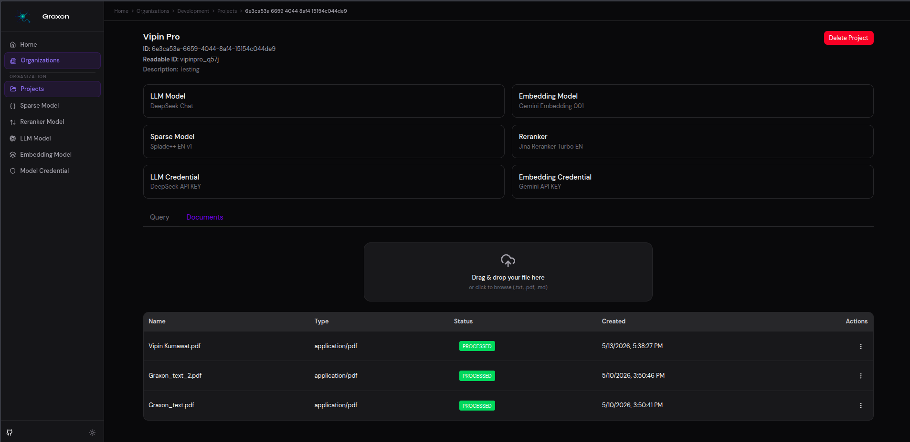
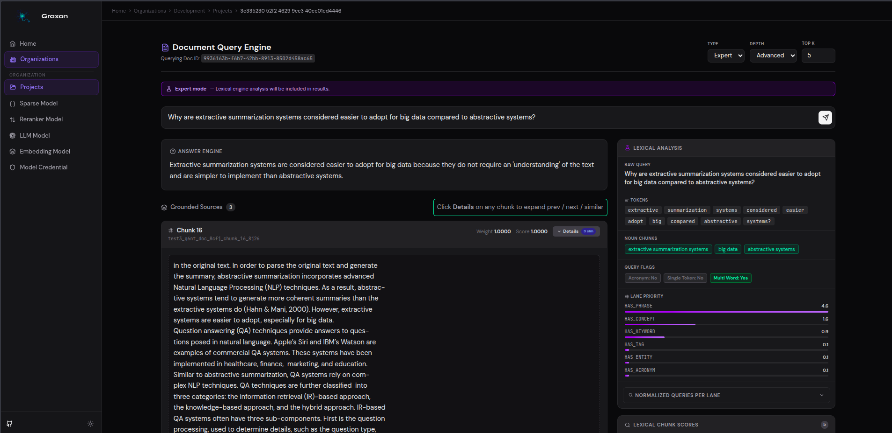
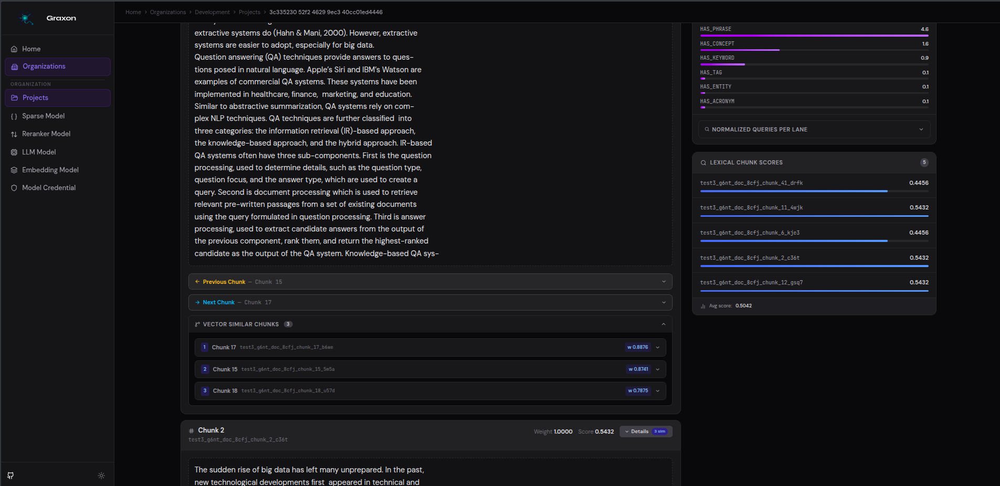
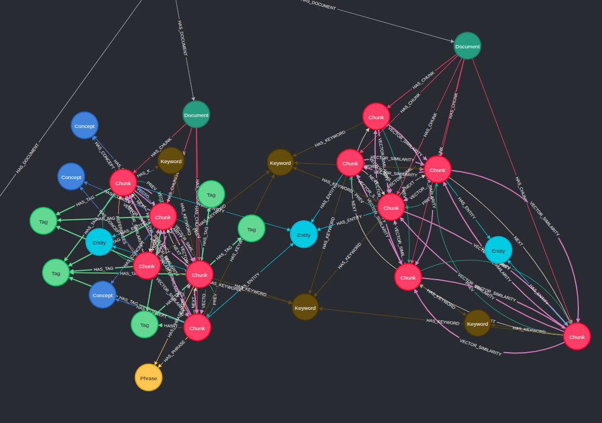
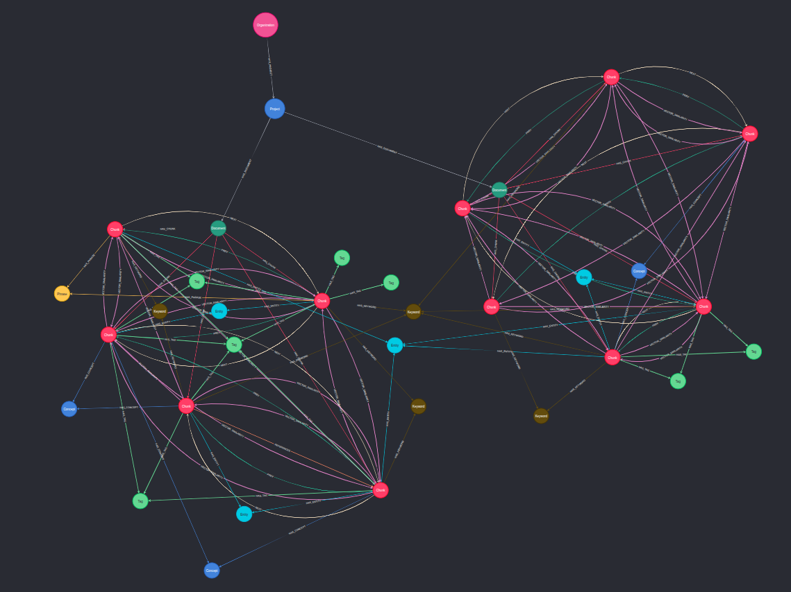
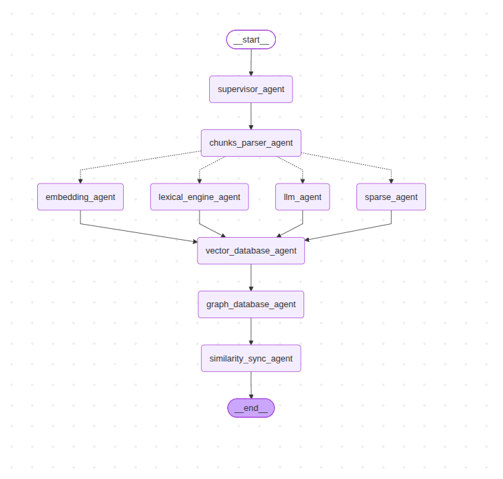
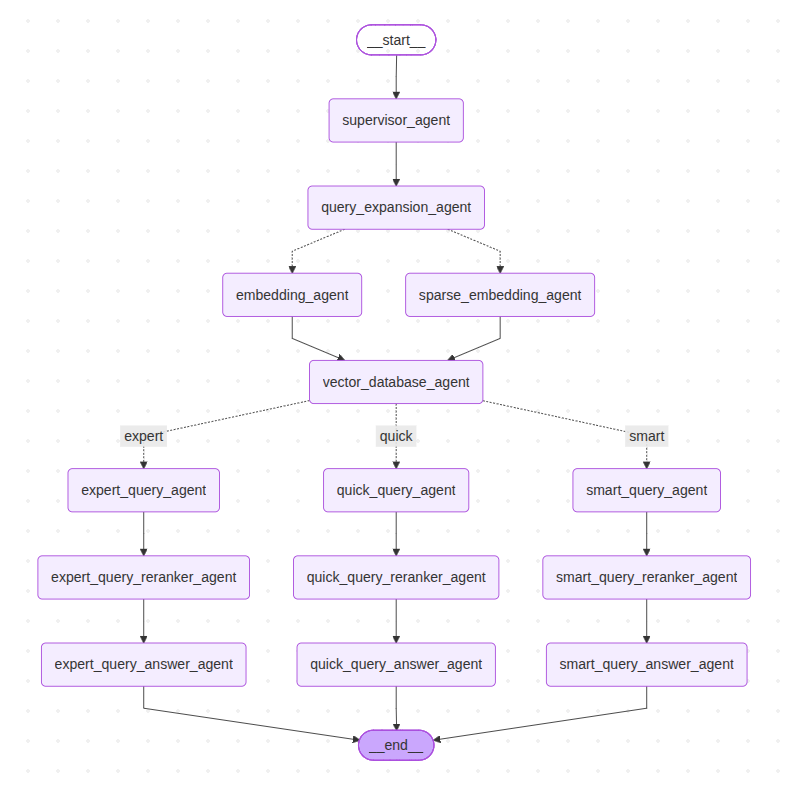

# Graxon

> **First Open-Source Hybrid RAG to eliminate hallucinations through a persistent Knowledge Graph layer.**

Graxon combines dense vector search, sparse retrieval, and a structured Knowledge Graph to deliver accurate, traceable, and context-aware answers — at scale, across multiple organizations, projects, and documents.

---

## Table of Contents

- [Overview](#overview)
- [Images](#images)
- [Videos](#videos)
- [Architecture](#architecture)
- [Infrastructure](#infrastructure)
- [Data Model](#data-model)
- [Ingestion Pipeline](#ingestion-pipeline)
- [Lexical Engine](#lexical-engine)
- [Resilient Ingestion & Checkpointing](#resilient-ingestion--checkpointing)
- [Query Pipeline](#query-pipeline)
- [Getting Started](#getting-started)
- [Execution Choices](#execution-choices)
- [Swagger](#swagger)

---

## Overview

Traditional RAG systems rely purely on vector similarity, which can retrieve plausible but semantically incorrect chunks. Graxon solves this by layering a **persistent Knowledge Graph** on top of hybrid vector retrieval — connecting chunks through typed, weighted edges that capture real semantic relationships.

**Key properties:**

- **Multi-Tenant** — isolated workspaces per organization
- **Multi-Project** — scoped retrieval within projects
- **Multi-Document** — fine-grained document management
- **Hybrid Retrieval** — dense vectors + sparse BM25 + graph traversal
- **Hallucination Reduction** — graph-grounded answers anchored to structured knowledge

---

## Images



<br/>
<br/>



<br/>
<br/>



## Videos

### UI

https://drive.google.com/file/d/1Luv6NVNh1e1VJPmGp_eXtB1fy4n7NVey/view?usp=drive_link

### Graph DB

https://drive.google.com/file/d/1fi_lNDTBxRy3jGuS0spnw0dNXraPAbwf/view?usp=sharing

---

<br/>

## Architecture

```
Orgs
 └── Projects
      └── Documents
           └── Chunks
```

Each document is chunked, processed through a multi-agent pipeline, stored in a vector database and a knowledge graph, and wired with semantic edges for retrieval.

---

## Infrastructure

| Component      | Role                                             |
| -------------- | ------------------------------------------------ |
| **Qdrant**     | Vector database — dense + sparse embeddings      |
| **Neo4j**      | Graph database — chunk nodes, semantic edges     |
| **PostgreSQL** | Primary relational database                      |
| **PgBouncer**  | PostgreSQL connection pooler                     |
| **MinIO**      | Object storage — raw document files              |
| **RabbitMQ**   | Message broker — async pipeline orchestration    |
| **Redis**      | In-memory cache — sessions, queues, fast lookups |

---

## Data Model

### Hierarchy

```
Organization
  └── Project
        └── Document
              └── Chunk
```

### Graph Node: `Chunk`

Each chunk is stored as a node in Neo4j and a vector in Qdrant. Nodes are connected by typed, weighted edges:

| Edge Type        | Description                                     |
| ---------------- | ----------------------------------------------- |
| `PREV` / `NEXT`  | Sequential order within the document            |
| `HAS_TAG`        | LLM-extracted semantic tags                     |
| `HAS_KEYWORD`    | TF-IDF significant keywords                     |
| `HAS_PHRASE`     | Shared n-gram phrases                           |
| `HAS_ENTITY`     | Named entities (NER)                            |
| `HAS_CONCEPT`    | Extracted noun phrases / concepts               |
| `HAS_ACRONYM`    | Acronym-to-definition links                     |
| `VECTOR_SIMILAR` | High cosine similarity between chunk embeddings |

All edges carry a **weight** for ranked graph traversal during retrieval.

### Images



<br/>
<br/>



---

## Ingestion Pipeline

Graxon uses **LangGraph** to orchestrate a parallel multi-agent pipeline at ingestion time.

```
Document
   │
   ▼
Chunking
   │
   ▼
LangGraph Pipeline
   ├── LLM Agent          → tags, inter-chunk relations
   ├── Embedding Agent    → dense vectors (OpenAI / Gemini / Voyage)
   ├── Sparse Agent       → sparse vectors via FastEmbed (BM25 / Qdrant sparse)
   └── Lexical Engine     → entities, concepts, keywords, phrases, acronyms
   │
   ├── Vector Store Agent
   │     └── Qdrant ← dense + sparse embeddings
   │
   ├── Graph DB Agent
   │     └── Neo4j ← chunk nodes
   │                 ├── PREV / NEXT edges
   │                 ├── HAS_TAG, HAS_KEYWORD, HAS_PHRASE ...
   │                 └── (all with weights)
   │
   └── Vector Similarity Sync
         └── Top-K similar chunks from Qdrant
               └── Neo4j ← VECTOR_SIMILAR edges (with cosine weight)
```

### Images



---

### Agents

**LLM Agent**
Sends chunks to an LLM to extract semantic tags and inter-chunk relationships. Results become typed edges in the knowledge graph.

**Embedding Agent**
Generates dense vector embeddings using pluggable providers — OpenAI, Google Gemini, or Voyage AI. Stored in Qdrant for ANN search.

**Sparse Embedding Agent**
Generates sparse vectors via **FastEmbed** for BM25-style retrieval and Qdrant's sparse vector support. Enables lexical precision alongside semantic recall.

**Lexical Engine**
SpaCy-powered linguistic analysis that extracts structured signals from each chunk. See [Lexical Engine](#lexical-engine) below.

### Vector Similarity Sync

After all chunks are stored in Qdrant, Graxon runs a post-ingestion pass: for each chunk, it fetches the top-K most similar chunks by embedding cosine similarity and writes `VECTOR_SIMILAR` edges into Neo4j with the similarity score as the edge weight. This bridges the vector and graph layers.

---

## Lexical Engine

Graxon uses **SpaCy** as its lexical engine to extract structured linguistic signals from chunks, which are then converted into graph edges.

### Entity Extraction (NER)

Detects shared named entities — people, organizations, products, and technologies — across chunks. Creates strong semantic links between chunks discussing the same real-world subject, improving graph-based retrieval accuracy.

### Concept Extraction (Noun Phrases)

Extracts meaningful noun phrases and technical concepts shared between chunks. Connects semantically related ideas even when exact keywords differ, improving topic grouping and contextual understanding.

### TF-IDF Keyword Linking

Uses TF-IDF scoring to detect rare but informative keywords appearing across multiple chunks, while filtering common noise words. Highlights statistically important terms that strengthen semantic relationships.

### Phrase Bridge Detection

Detects exact shared n-gram phrases between chunks to capture repeated terminology and strong lexical overlap. Especially useful for technical, scientific, and domain-specific documents where repeated phrases carry important meaning.

### Acronym Resolution

Detects acronym definitions and links them to later acronym usage throughout the document. Improves long-document comprehension by connecting abbreviated references back to their original meaning.

### Edge Construction

Converts all detected lexical relationships — entities, concepts, keywords, phrases, and acronyms — into typed, weighted graph edges connecting related chunks in Neo4j.

### Edge Deduplication

Removes duplicate or weaker relationships while preserving the strongest semantic connections. Keeps the graph cleaner and more efficient to traverse during retrieval and ranking.

---

## Resilient Ingestion & Checkpointing

Most RAG pipelines work great in a notebook. At enterprise scale, they fall apart.

Rate limits spike. Workers crash. If your ingestion fails at page 800 of a 1,000-page document, an all-or-nothing architecture forces a full restart — burning engineering time and duplicate LLM tokens.

Graxon is built with an **infrastructure-first mindset** to make ingestion deterministic, fault-tolerant, and resumable by design.

---

### Zero-Loss Macro & Micro Checkpointing

Graxon treats ingestion like a **transaction log**, decoupling graph state and persisting checkpoints across two layers:

| Layer                 | Store      | Role                                     |
| --------------------- | ---------- | ---------------------------------------- |
| **Micro checkpoints** | Redis      | Hot in-memory state tracking per chunk   |
| **Macro checkpoints** | MinIO (S3) | Cold artifact backups per document/batch |

If an API provider or worker node crashes mid-ingestion, Graxon **hot-boots and resumes from the exact chunk it left off** — no full restart, no wasted tokens.

---

### Ironclad Idempotency & Atomicity

Resuming a failed pipeline usually introduces duplicate vectors or corrupted graph linkages. Graxon guarantees a **zero-duplicate footprint** by design:

**Qdrant**

- Deterministic `uuid5` hashing seeded by structured `chunk_id`s
- Ensures every vector upsert is fully idempotent — re-ingesting a chunk overwrites cleanly, never duplicates

**Neo4j**

- Single-transaction bulk uploads via optimized Cypher `UNWIND` clauses
- Strict `ON CREATE` / `ON MATCH` state isolation preserves temporal metadata and guarantees ACID consistency

---

### Multi-Engine Parallel Fan-Out

Rather than sequential processing, Graxon uses LangGraph to run a parallelized scatter-gather pipeline across all storage layers simultaneously:

- **Dense vectors** → Qdrant (deep semantic similarity)
- **Sparse vectors** → FastEmbed / BM25 → Qdrant (lexical exact matching)
- **Knowledge Graph** → Neo4j (chunk nodes, entity tags, structural edges)
- **Lexical Analysis** → SpaCy (natural textual topology)

All four engines process each chunk concurrently — maximizing throughput and minimizing ingestion latency at scale.

---

## Query Pipeline

Graxon uses a **LangGraph-orchestrated query pipeline** with 3 query types and 2 depth levels, giving fine-grained control over retrieval quality vs. speed.

---

### Flow Overview

```
__start__
    │
    ▼
supervisor_agent
    │
    ▼
query_expansion_agent
    ├── embedding_agent          (dense embedding of expanded query)
    └── sparse_embedding_agent   (sparse / BM25 embedding)
    │
    ▼
vector_database_agent            (hybrid retrieval from Qdrant)
    │
    ├── [expert] ──► expert_query_agent ──► expert_query_reranker_agent ──► expert_query_answer_agent
    ├── [quick]  ──► quick_query_agent  ──► quick_query_reranker_agent  ──► quick_query_answer_agent
    └── [smart]  ──► smart_query_agent  ──► smart_query_reranker_agent  ──► smart_query_answer_agent
    │
    ▼
__end__  (answer + metadata / sources)
```

Every query — regardless of mode or depth — begins with:

1. **Query expansion** via LLM
2. **Dense + sparse embedding** of the expanded query
3. **Hybrid retrieval** from Qdrant (dense + BM25 vectors)

<br/>
<br/>



---

### Query Types & Depth

#### Quick

Lightweight retrieval with immediate document context.

| Depth        | Retrieval                                               |
| ------------ | ------------------------------------------------------- |
| **Standard** | Vector DB chunks + `PREV` / `NEXT` neighbors from Neo4j |
| **Advanced** | Same as Standard                                        |

---

#### Smart

Adds graph-based semantic expansion on top of Quick.

| Depth        | Retrieval                                                                      |
| ------------ | ------------------------------------------------------------------------------ |
| **Standard** | Quick (Standard) + `VECTOR_SIMILAR` chunks from Neo4j for each retrieved chunk |
| **Advanced** | Smart (Standard) + `PREV` / `NEXT` neighbors for each `VECTOR_SIMILAR` chunk   |

---

#### Expert

Full hybrid retrieval combining vector, graph, and lexical signals with a unified chunk scoring system.

| Depth        | Retrieval                                                                                                                                                 |
| ------------ | --------------------------------------------------------------------------------------------------------------------------------------------------------- |
| **Standard** | Smart (Advanced) + embedding comparison of query against Tags, Keywords, Concepts, Entities, Phrases, Acronyms filtered by `EQ_GTE_LANE_WEIGHT_THRESHOLD` |
| **Advanced** | Expert (Standard) + Lexical Engine picks best lanes and top `EQ_MAX_LANE_ENTITY` matches per lane                                                         |

##### Expert Chunk Scoring

Every `chunk_id` accumulates a score across all retrieval signals:

| Signal                                                   | Score |
| -------------------------------------------------------- | ----- |
| Present in Vector DB results                             | `++`  |
| Present as `PREV` / `NEXT` or `VECTOR_SIMILAR` neighbor  | `++`  |
| Matched via query–tag / keyword / concept embedding      | `++`  |
| Matched via Lexical Engine lane _(Expert Advanced only)_ | `++`  |

Top `EQ_MAX_CHUNKS` chunks by final score are forwarded to the answer agent.

---

### Reranking & Answer Generation

After retrieval, every mode runs:

1. **Reranker agent** — reranks the retrieved chunk set, selects Top-K
2. **Answer agent** — passes expanded query + context window to LLM
3. **Response** — returns the answer with full **metadata and sources**

---

### Configuration

| Variable                       | Description                                                               |
| ------------------------------ | ------------------------------------------------------------------------- |
| `EQ_GTE_LANE_WEIGHT_THRESHOLD` | Minimum similarity score for tag / keyword / concept lane matching        |
| `EQ_MAX_CHUNKS`                | Maximum chunks selected after expert scoring                              |
| `EQ_MAX_LANE_ENTITY`           | Top entities picked per lane by the Lexical Engine (Expert Advanced only) |

---

## Getting Started

### Clone the repository

```bash
git clone https://github.com/Graxon-rag/graxon.git
cd graxon
```

## Execution Choices

### 1. Local Development (Native)

Best if you prefer to run the app directly on your host machine without containerization.

1. Create a `.env` from `.env.example`
   ```bash
   cp .env.example .env
   ```
2. Create a `Virtual Env` and `enable` it
   ```bash
   python -m venv .venv
   source .venv/bin/activate
   ```
3. Install all dependencies
   ```bash
   pip install -r requirements.txt
   ```
4. Up all the engines/ databases/ store
   ```bash
   docker compose up -d
   ```
5. Run the migration
   ```bash
   alembic upgrade head
   ```
6. Run the server
   ```bash
    chmod +x dev.sh
    ./dev.sh
   ```

### 2. Docker Development (With Container HMR)

Best for keeping your host machine clean while maintaining instant hot-reloading (Hot Module Replacement) as you change your code.

1. Create a `.env.docker` from `.env.docker.example`

   ```bash
   cp .env.docker.example .env.docker
   ```

2. Build the image
   ```bash
   docker compose -f docker-compose-dev.yaml build
   ```
3. Run Container

   ```bash
   docker compose -f docker-compose-dev.yaml up -d
   ```

   The server will be accessible at http://localhost:8888

   #### To view live container logs:

   ```bash
   docker compose -f docker-compose-dev.yaml logs -f
   ```

### 3. Docker Production

Run the images from `docker-hub`

1. Create a `.env.docker` from `.env.docker.example`

   ```bash
   cp .env.docker.example .env.docker
   ```

2. Run Container

   ```bash
   docker compose -f docker-compose-prod.yaml up -d
   ```

   The server will be accessible at http://localhost:8888

   #### To view live container logs:

   ```bash
   docker compose -f docker-compose-prod.yaml logs -f
   ```

### Stopping Containers

If you are running either of the Docker variations, you can spin down the environments using:

- #### For Development:
  docker compose -f docker-compose-dev.yaml down
- #### For Production:
  docker compose -f docker-compose-prod.yaml down

---

## Swagger

After running the Server you can read the `swagger`

http://localhost:8888/docs

- **Username**: admin
- **Password**: admin

---

<br/>

## Adding New Migrations

When you make changes to SQLAlchemy models, generate a new migration:

```bash
alembic revision --autogenerate -m "your_migration_description"
```

Then apply it:

```bash
alembic upgrade head
```

> Only modify tables listed in `GRAXON_OWNED_TABLES` inside `migrations/env.py`.
> Do not add tables owned by other services.

---

## Rolling Back Migrations

Roll back the last migration:

```bash
alembic downgrade -1
```

Roll back to a specific revision:

```bash
alembic downgrade <revision_id>
```

---

## Checking Migration Status

```bash
alembic current   # shows current revision
alembic history   # shows full migration history
```

---

## Seeding

Seeding runs automatically on first startup — no manual step needed.

It inserts:

- Default organization (`dev`)
- LLM models (OpenAI, Claude, Gemini, DeepSeek)
- Embedding models (OpenAI, Voyage, Gemini)
- Reranker models
- Sparse text models
- Default Neo4j organization node

If you need to re-seed (e.g. after wiping the database), delete the `seed_tracker` table row:

```sql
DELETE FROM seed_tracker;
```

Then restart the server.

## Spacy

```py
spacy download en_core_web_sm
```
